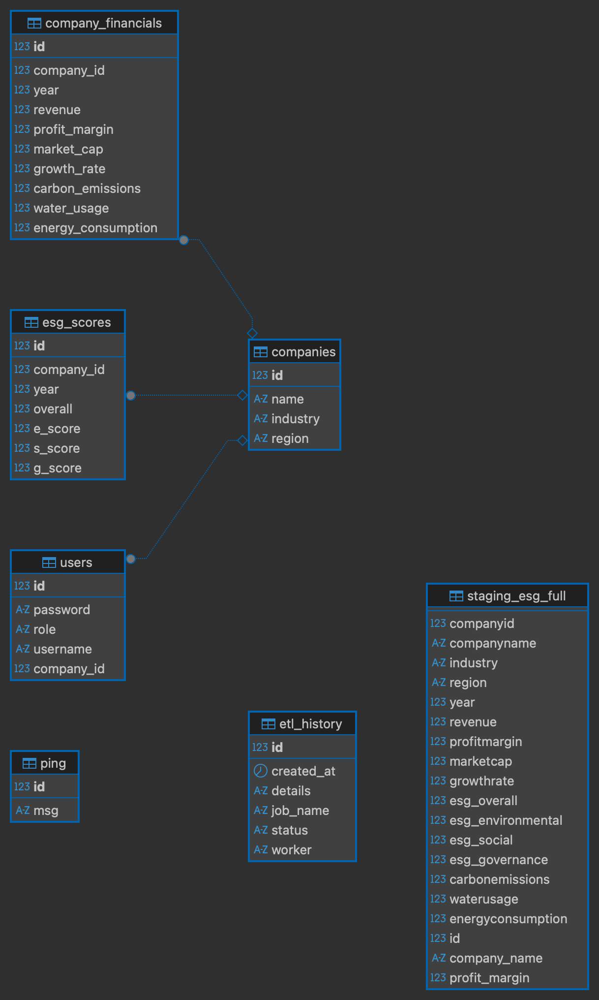
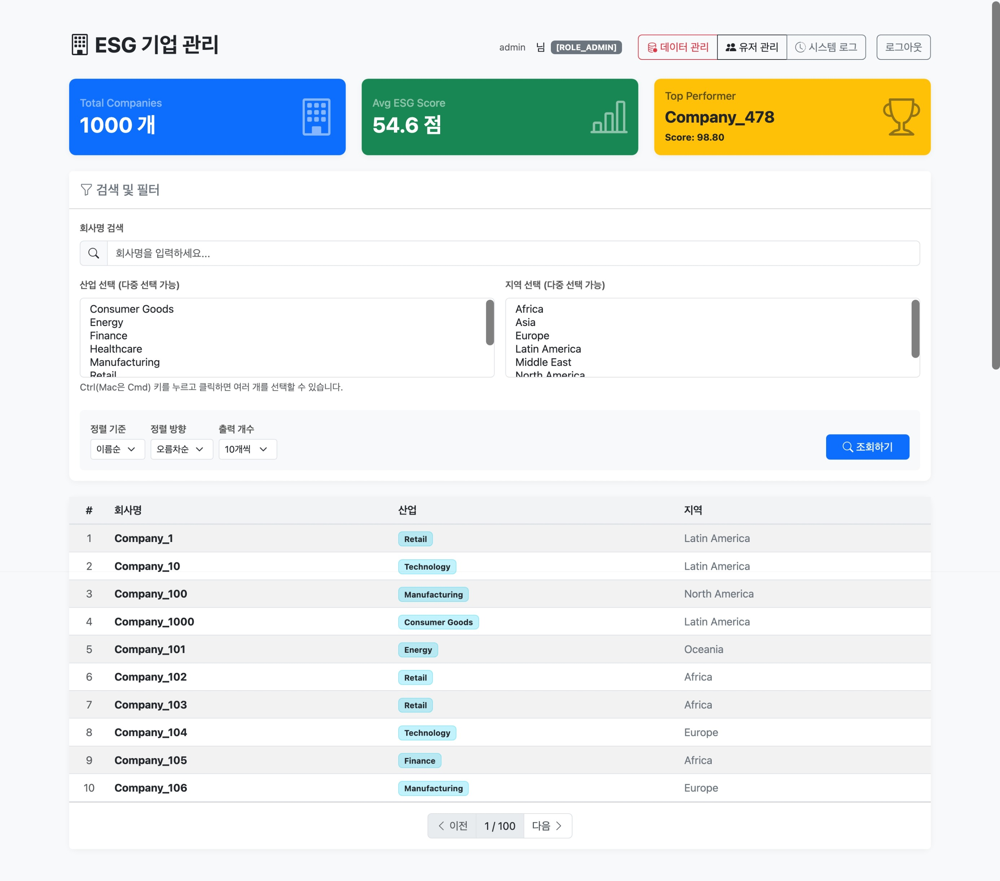
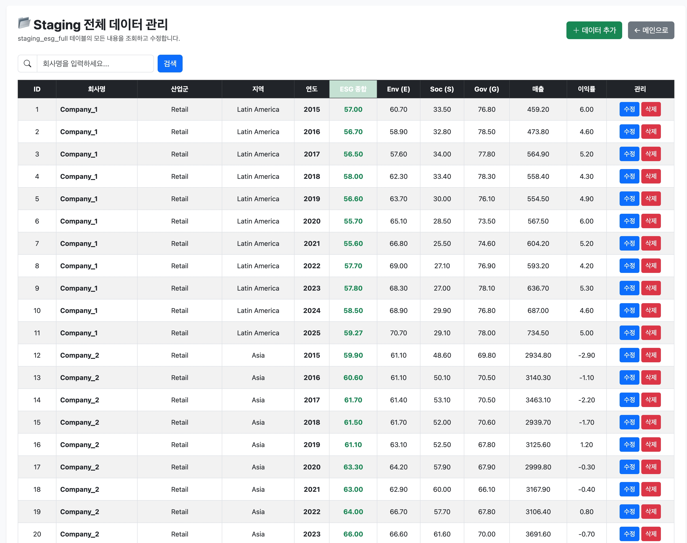
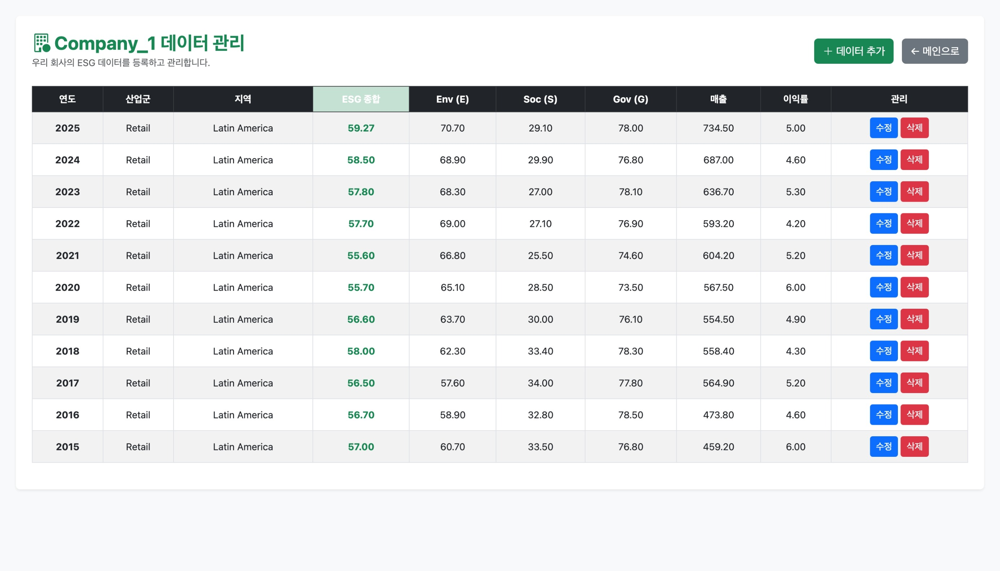
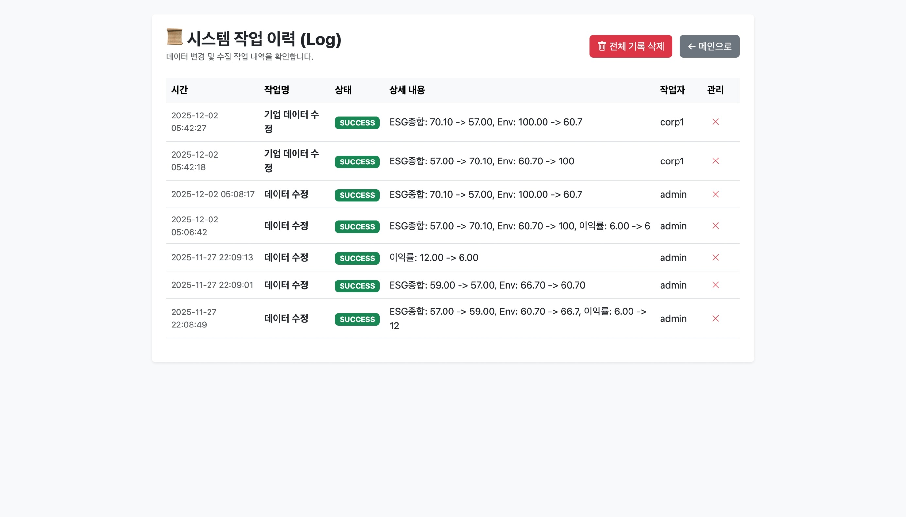

# 🌍 ESG Corporate Evaluation & Management System
> **기업 ESG(환경·사회·지배구조) 평가 데이터 자동화 및 관리 플랫폼**

본 프로젝트는 기업의 ESG 점수와 재무 데이터를 체계적으로 수집, 관리하고 시각화하여 제공하는 웹 애플리케이션입니다.  
데이터의 신뢰성을 보장하기 위해 **Staging(대기소) 영역을 통한 검증 시스템**과 **실시간 동기화(ETL) 파이프라인**을 구축하였으며, 사용자 역할(Role)에 따른 철저한 권한 분리(RBAC)를 구현했습니다.

---

## 🛠️ Tech Stack

### Backend
- **Java 17**
- **Spring Boot 3.x**
- **Spring Security** (RBAC 기반 권한 관리)
- **Spring Data JPA** (ORM)
- **Gradle**

### Database
- **PostgreSQL** (Production DB)

### Frontend
- **Thymeleaf** (Server-Side Rendering)
- **Bootstrap 5** (Responsive UI)
- **Chart.js** (Data Visualization)

---

## 🚀 Key Features (핵심 기능)

### 1. 🛡️ 신뢰성 있는 데이터 관리 (Data Integrity)
- **Staging & Production 분리:** 관리자가 등록/수정한 데이터는 `Staging` 테이블에서 1차적으로 관리되며, 데이터의 무결성을 유지합니다.
- **Real-time ETL:** Staging 데이터가 수정되거나 추가되는 즉시 실제 서비스 테이블(`Companies`, `EsgScores`, `Financials`)로 자동 동기화되어 서비스에 반영됩니다.

### 2. 🔐 역할 기반 접근 제어 (RBAC)
- **Admin (관리자):**
    - **데이터 관리:** Staging 테이블의 전체 데이터를 조회, 추가, 수정, 삭제할 수 있습니다.
    - **유저 관리:** 가입된 회원의 목록을 조회하고, 권한(일반 ↔ 기업 담당자)을 변경할 수 있습니다.
    - **시스템 로그:** 데이터 변경 작업(누가, 언제, 무엇을)에 대한 상세 이력을 조회하고 관리합니다.
- **Corporate (기업 담당자):**
    - **자사 데이터 관리:** 회원가입 시 등록한 소속 회사의 데이터만 조회 및 수정할 수 있습니다 (타 기업 데이터 접근 불가).
    - **데이터 자동 생성:** 데이터가 없는 연도를 추가하면 자동으로 ID가 부여되고 시스템에 등록됩니다.
- **Public (일반 사용자):**
    - **대시보드:** 전체 기업의 통계 요약 정보를 확인할 수 있습니다.
    - **검색 및 시각화:** 기업명, 산업군, 지역별 필터링 검색이 가능하며, 상세 페이지에서 연도별 ESG 점수 추이를 차트로 확인할 수 있습니다.

### 3. 📜 시스템 감사 로그 (Audit Trail)
- 데이터의 추가, 수정, 삭제가 발생할 때마다 **'작업자, 시간, 변경 상세 내용(Before -> After)'**을 로그로 기록합니다.
- 관리자는 이력을 통해 시스템의 데이터 변경 흐름을 투명하게 추적할 수 있습니다.

---

## 📊 ERD (Entity Relationship Diagram)



---

## 💻 Service Screen

|               메인 대시보드 (Public)                |              데이터 관리 (Admin)              |
|:---------------------------------------------:|:----------------------------------------:|
|           |  |
|              **내 기업 관리 (Corp)**               |           **시스템 작업 이력 (Log)**            |
|  |    |

---

## ⚙️ How to Run

1. **Connect URL**
   ```bash
   https://esg-platform-web.onrender.com
